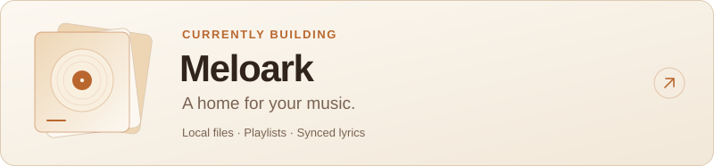

<picture>
  <source media="(prefers-reduced-motion: reduce) and (max-width: 480px) and (prefers-color-scheme: dark)" srcset="assets/header-dark-small.svg">
  <source media="(prefers-reduced-motion: reduce) and (max-width: 480px)" srcset="assets/header-light-small.svg">
  <source media="(prefers-reduced-motion: reduce) and (prefers-color-scheme: dark)" srcset="assets/header-dark.svg">
  <source media="(prefers-reduced-motion: reduce)" srcset="assets/header-light.svg">
  <source media="(max-width: 480px) and (prefers-color-scheme: dark)" srcset="assets/header-dark-small.gif">
  <source media="(max-width: 480px)" srcset="assets/header-light-small.gif">
  <source media="(prefers-color-scheme: dark)" srcset="assets/header-dark.gif">
  <source media="(prefers-color-scheme: light)" srcset="assets/header-light.gif">
  
</picture>

 

  I build <strong>local-first browser tools</strong> with React and TypeScript. 
  Clear interfaces, built around your own files.

 

### Selected work

<a href="https://meloark.markdsilva.com/">
  <picture>
    <source media="(max-width: 600px) and (prefers-color-scheme: dark)" srcset="assets/meloark-card-dark-small.svg">
    <source media="(max-width: 600px)" srcset="assets/meloark-card-light-small.svg">
    <source media="(prefers-color-scheme: dark)" srcset="assets/meloark-card-dark.svg">
    <source media="(prefers-color-scheme: light)" srcset="assets/meloark-card-light.svg">
    
  </picture>
</a>

Play your local library, organize playlists, and follow synchronized lyrics. Your audio stays on your device; online lyrics are optional.

**[Open Meloark →](https://meloark.markdsilva.com/)** &nbsp; · &nbsp; [View source](https://github.com/markdsilva/Meloark) &nbsp; · &nbsp; [Report an issue](https://github.com/markdsilva/Meloark/issues)

Meloark = melody + ark — a home for your music.

 

### Toolkit

  <picture><source media="(prefers-color-scheme: dark)" srcset="assets/tool-react-dark.svg"></picture>&nbsp;
  <picture><source media="(prefers-color-scheme: dark)" srcset="assets/tool-typescript-dark.svg"></picture>&nbsp;
  <picture><source media="(prefers-color-scheme: dark)" srcset="assets/tool-vite-dark.svg"></picture>

Also working with IndexedDB and native browser audio.

 

### Earlier work

**[Vision-Based Fall Detection ↗](https://github.com/markdsilva/vision-based-fall-detection)** 
Archived academic project · Python · PyTorch · OpenCV

A college prototype exploring pose estimation, tracking, and action recognition to identify possible falls in video.

 

---

  <a href="https://github.com/markdsilva?tab=repositories&amp;type=public">Explore my public repositories ↗</a>

