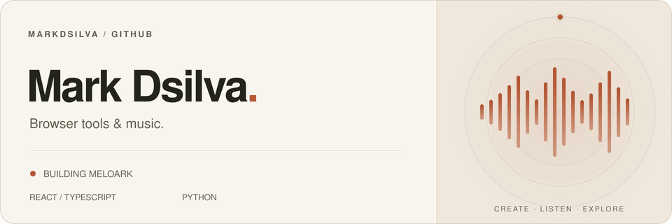

<picture>
  <source media="(prefers-reduced-motion: reduce) and (max-width: 480px) and (prefers-color-scheme: dark)" srcset="assets/header-dark-small.svg">
  <source media="(prefers-reduced-motion: reduce) and (max-width: 480px)" srcset="assets/header-light-small.svg">
  <source media="(prefers-reduced-motion: reduce) and (prefers-color-scheme: dark)" srcset="assets/header-dark.svg">
  <source media="(prefers-reduced-motion: reduce)" srcset="assets/header-light.svg">
  <source media="(max-width: 480px) and (prefers-color-scheme: dark)" srcset="assets/header-dark-small.gif">
  <source media="(max-width: 480px)" srcset="assets/header-light-small.gif">
  <source media="(prefers-color-scheme: dark)" srcset="assets/header-dark.gif">
  <source media="(prefers-color-scheme: light)" srcset="assets/header-light.gif">
  
</picture>

 

I build **local-first browser tools** with **React and TypeScript**, with a focus on clear interfaces and keeping your data on your device.

 

##  Meloark

Currently building · A local-first music player and library

> **Your music. Your device. Your browser.**

A home for your music collection, right in your browser. Explore your albums, make playlists, and follow synchronized lyrics without uploading your audio.

- **Listen** — Play local tracks and explore album artwork and audio details.
- **Organize** — Create and reorder playlists, undo changes, and export M3U8 files.
- **Follow along** — Use local LRC files or opt into online lyrics.

**[Open Meloark →](https://meloark.markdsilva.com/)** &nbsp; · &nbsp; [Source ↗](https://github.com/markdsilva/Meloark) &nbsp; · &nbsp; [Issues ↗](https://github.com/markdsilva/Meloark/issues)

Melody + ark — a home for your music.

 

##  Tools

  &nbsp;&nbsp;&nbsp;
  &nbsp;&nbsp;&nbsp;
  

React · TypeScript · Vite &nbsp; / &nbsp; IndexedDB · Native browser audio

 

<strong>Earlier work</strong> &nbsp; · &nbsp; Vision-based fall detection

 

### [Vision-Based Fall Detection ↗](https://github.com/markdsilva/vision-based-fall-detection)

A college prototype exploring person detection, pose estimation, tracking, and action recognition to identify possible falls in video.

  &nbsp;&nbsp;&nbsp;
  &nbsp;&nbsp;&nbsp;
  

Python · PyTorch · OpenCV &nbsp; / &nbsp; Archived academic prototype

 

---

[Explore my public repositories →](https://github.com/markdsilva?tab=repositories&amp;type=public)
