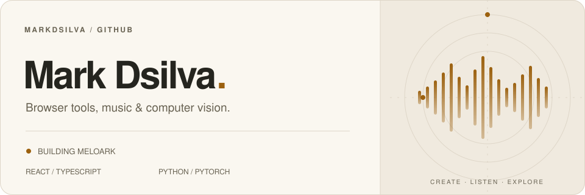
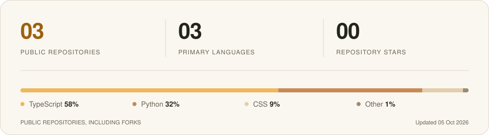

<picture>
  <source media="(prefers-color-scheme: dark)" srcset="assets/header-dark.svg">
  <source media="(prefers-color-scheme: light)" srcset="assets/header-light.svg">
  
</picture>

 

I build browser-based tools with **React and TypeScript**. My public projects span local music libraries and an earlier exploration of computer vision in Python.

**Currently building:** [Meloark](https://github.com/markdsilva/Meloark) — a home for your music.

 

### 01 / Featured project

#### [Meloark ↗](https://github.com/markdsilva/Meloark)

**Your music. Your device. Your browser.**

A local-first music player and library. Explore your albums, build and export M3U8 playlists, and follow synchronized lyrics without uploading your audio.

| Listen | Organize | Follow along |
| :--- | :--- | :--- |
| Play local tracks and browse artwork and audio details. | Edit playlists, reorder tracks, and undo changes. | Load local LRC files or opt into online lyrics. |

**[Open Meloark →](https://meloark.markdsilva.com/)** &nbsp; · &nbsp; [Explore the code](https://github.com/markdsilva/Meloark) &nbsp; · &nbsp; [Report an issue](https://github.com/markdsilva/Meloark/issues)

React · TypeScript · Vite · IndexedDB · Native browser audio

<strong>Meloark</strong> = melody + ark — a home for your music collection. Evolved from TrackIndex; the original project remains a reference.

 

### 02 / Earlier exploration

#### [Vision-Based Fall Detection ↗](https://github.com/markdsilva/vision-based-fall-detection)

A college computer-vision prototype combining person detection, pose estimation, tracking, and action recognition to identify possible falls in video.

Python · PyTorch · OpenCV &nbsp; / &nbsp; Archived · Academic prototype · No longer maintained

 

### 03 / Tools in these projects

  &nbsp;&nbsp;
  &nbsp;&nbsp;
  &nbsp;&nbsp;
  &nbsp;&nbsp;
  &nbsp;&nbsp;
  

Web: React / TypeScript / Vite &nbsp; · &nbsp; Vision: Python / PyTorch / OpenCV

 

<strong>Public repository stats</strong>

 

<picture>
  <source media="(max-width: 600px) and (prefers-color-scheme: dark)" srcset="assets/stats-mobile-dark.svg">
  <source media="(max-width: 600px) and (prefers-color-scheme: light)" srcset="assets/stats-mobile-light.svg">
  <source media="(prefers-color-scheme: dark)" srcset="assets/stats-dark.svg">
  <source media="(prefers-color-scheme: light)" srcset="assets/stats-light.svg">
  
</picture>

Language mix across public repositories, including forks. Refreshed daily.

---

[Browse my public repositories →](https://github.com/markdsilva?tab=repositories&amp;type=public)
